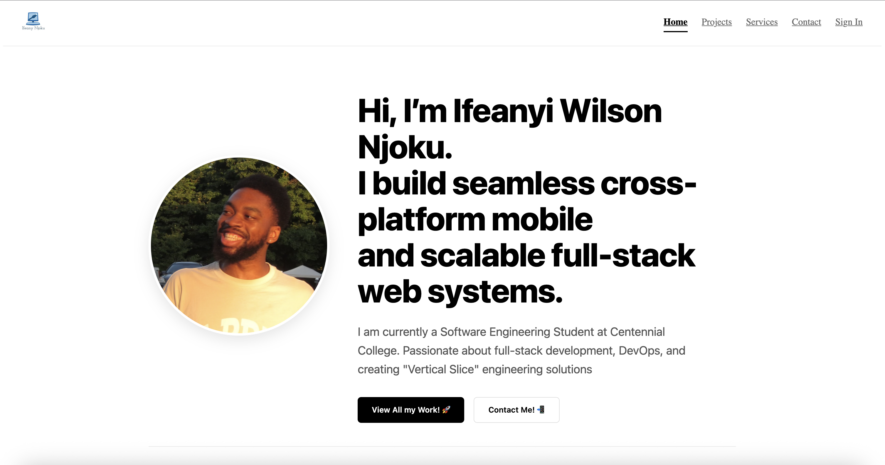

# Portfolio V2 - Full Stack Engineering Showcase

## 🚀 Overview

This is a full-stack portfolio application designed to showcase my engineering capabilities, projects, and services. Unlike standard static portfolios, this application is powered by a custom **MERN Stack (MongoDB, Express, React, Node.js)** backend, featuring a bespoke Content Management System (CMS) that allows for real-time updates to projects, services, and engineering capabilities.

**Live Demo:** [https://assignment-1-portfolio-site.onrender.com/]

## 🛠 Tech Stack

**Frontend:**
* **React (Vite):** For a high-performance, component-based UI.
* **Axios:** For robust HTTP requests and interceptor management.
* **React Router:** Client-side routing with protected admin paths.
* **CSS3:** Custom responsive styling with a focus on minimalist, editorial design.

**Backend:**
* **Node.js & Express:** RESTful API architecture.
* **MongoDB (Atlas) & Mongoose:** Schema-based data modeling for Projects, Services, and Users.
* **JWT (JSON Web Tokens):** Secure stateless authentication for the Admin Dashboard.

## ✨ Key Features

* **Dynamic Content Management:** Projects and Services are fetched dynamically from the database, allowing for updates without redeploying the codebase.
* **Secure Admin Dashboard:** A protected route (`/admin`) allows authorized users to perform CRUD operations on portfolio content.
* **Authentication Middleware:** Custom middleware intercepts requests to protected endpoints, verifying JWTs to prevent unauthorized access.
* **Responsive Design:** Fully fluid layout optimized for mobile, tablet, and desktop viewing.

## 📂 Architecture

The application follows the **MVC (Model-View-Controller)** pattern to ensure separation of concerns:

* **Models:** Define the schema for `Projects`, `Services`, and `Contacts`.
* **Controllers:** Handle business logic, such as fetching data or verifying credentials.
* **Routes:** Map API endpoints to specific controller functions.
